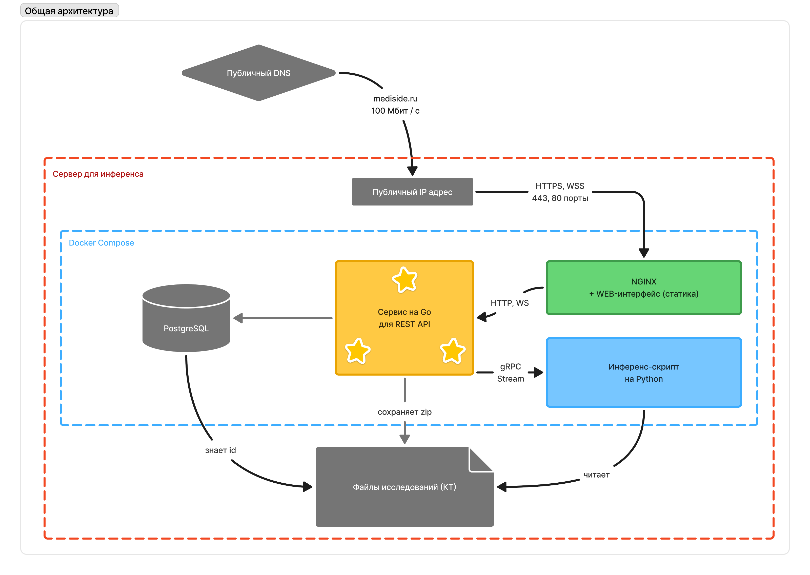

# 🩻 Mediside

<p align="center">
  
</p>
<p align="center">
  <a href="https://mediside.ru" target="_blank" rel="noopener noreferrer" style="margin-left: 30px; line-height: 1; align-self: center; font-size: 20px; padding-bottom: 20px;">
    mediside.ru
  </a>
</p>

[mediside.ru](https://mediside.ru) - Web-сервис для распознавания патологий на снимках КТ легких.

Сервис Mediside - это Web-приложение, предназначенное для распознавания паологий на снимках КТ легких с использованием ИИ. В качестве входных данных приложение ожидает ZIP-архивы с DICOM-изображениями внутри. После распознавания патологий появляется возможность скачать отчет в формате **XLSX**.

# 🚀 Локальное развертывание

Системные требования: 

1. Docker Compose v2.33.1
2. Желательно наличие GPU NVIDIA. В таком случае необходимо установить [NVIDIA Container Toolkit](https://docs.nvidia.com/datacenter/cloud-native/container-toolkit/latest/install-guide.html) и `nvidia-smi` 
3. NVIDIA GPU с VRAM не менее 12 ГБ
4. 16 ГБ ОЗУ, процессор с числом ядер не менее 4, пропускная способность сети от 100 Мбит/с

Если у вас нет GPU NVIDIA, то закомментируйте следующие строки в `docker-compose.yaml`:

```bash
runtime: nvidia
gpus: all
privileged: true
```

## 1️⃣ Клонирование репозиториев

Адреса подмодулей указаны для **SSH**. Вам нужно добавить ключ **SSH** в профиле GitHub. Клонируйте репозиторий с вытягиванием всех подмодулей:

```bash
git clone --recurse-submodules git@github.com:mediside/deploy.git mediside
cd mediside
```

## 2️⃣ Установка адреса

Web-интерфейсу нужно знать, по какому адресу работает сервер. В файле `./web/.env` описан этот адрес для HTTP и WebSocket:

```bash
# файл .env
VITE_PROD_API_URL=http://localhost:80/api/v1/
VITE_PROD_WS_URL=ws://localhost:80/api/v1/
```

В таком случае Web-интерфейс будет работать только на том ПК, на котором будет запущен Docker Compose. Если вам это подходит, то можно не менять конфиги на этом шаге.

Но если у вас есть локальная сеть, и вы хотите развернуть сервис, чтобы его можно было использовать с других устройств в этой сети, то нужно создать файл `./web/.env.local` и прописать в него переменные с адресом вашего ПК в локальной сети. Этот файл переопределит переменные из `./web/.env`. Пример для адреса `192.168.1.123`:

```bash
# файл .env.local
VITE_PROD_API_URL=http://192.168.1.123:80/api/v1/
VITE_PROD_WS_URL=ws://192.168.1.123:80/api/v1/
```

> Убедитесь, что порт 80 открыт на вашем сервере и не занят другими сервисами. В противном случае рекомендуется заменить порт `80`, например, на `3000`.

## 3️⃣ Запуск

Выполните запуск контейнеров командой ниже:

```bash
docker compose up -d
```

Откройте адрес `http://localhost:80` в браузере (или адрес вашего сервера в локальной сети, например `http://192.168.1.123:80`). Должна появиться форма ввода логина и пароля. Введите данные для входа, полученные на втором шаге. Должен загрузиться Web-интерфейс.

# ✅ Тестирование

Мы предлагаем три варианта тестирования.

## 1. Выгрузка исследований через сервис

1. Создайте коллекцию.
2. Используйте форму для загрузки файлов. Вы можете перетащить в нее сразу множество файлов. По мере их загрузки они будут отправлятся на инференс, а прогресс загрузки будет динамически меняться на форме. В случае, если загрузка прервалась на середине, просто перетащите все файлы заново - сервис отфильтрует уже загруженные файлы и не будет отправлять их по сети повторно.
3. Дождитесь окончания инференса. Скачайте отчет по кнопке **Скачать .XLSX**.

## 2. Размещение исследований в папке

1. Создайте коллекцию.
2. В заглушке под надписью "Запускаете сервис локально?" написан путь, по которому нужно положить ZIP-архивы исследований. Директория по этому пути будет расположена в данном репозитории. Скопируйте в эту директорию (например `./volumes/researches/5e33bda4-0abd`) ZIP-архивы исследований.
3. Нажмите кнопку **Начать инференс**. Оставайтесь в коллекции, чтобы наблюдать прогресс инференса.
4. Дождитесь окончания инференса. Скачайте отчет по кнопке **Скачать .XLSX**.

## 3. Скрипт (не рекомендуется)

Мы подготовили скрипт для автоматического тестирования нашего решения. Чтобы использовать его, введите ваш пароль для авторизации на [mediside.ru](https://mediside.ru) в переменную `PASSWORD = "ваш пароль"` в файле `autotest.py`. Создайте папку `./data` и поместите в нее архивы DICOM. Запустите тестирование командой:

```bash
python autotest.py
```

В консоли будет выводится имя отправленного файла и статус. Статус должен быть 200. Во время работы скрипта вы можете открыть [mediside.ru](https://mediside.ru), перейти в последнюю коллекцию и в режиме реального времени следить за статусом обработки файлов.

При возникновении ошибок в запросах попробуйте удалить файл `collection_id.txt` и перезапустить `python autotest.py` - возможно, коллекция на сайте была удалена, и ее нужно пересоздать через скрипт.

После запуска скрипта войдите на сайт и откройте созданную коллекцию - вы увидите прогресс обработки исследований. После завершения работы скрипта откройте коллекцию на сайте и скачайте отчет через интерфейс.

Если вы уже выгрузили достаточно много архивов, и скрипт по каким-либо причинам прервался, то можно удалить уже выгруженные исследования из папки и запустить скрипт заново для экономии времени. Вы в любой момент сможете зайти на сайт и скачать отчет.

# О проекте

Дополнительно о сервисе можно прочитать [здесь](https://mediside.ru/about).

## 🏎 Быстрый старт

1. Перейдите [mediside.ru](https://mediside.ru)
2. Введите логин и пароль в форму
3. Создайте и откройте коллекцию, нажав панель "Классифицируйте" на главной странице
4. Перетащите ZIP-архив с DICOM-исследованием в область для загрузки в верхней части страницы
5. Дождитесь окончания загрузки и инференса. Прогресс обновляется в реальном времени
6. Скачайте отчет, нажав кнопку "Скачать .XLSX"

## 🖥 Характеристики сервера mediside.ru

Решение развернуто на сервере со следующими характеристиками:

- GPU: NVIDIA RTX 5070 12GB VRAM
- CPU: Ryzen 7500f 6 ядер
- RAM: DDR5 32GB 5600 MHz
- SSD: 220GB, ~160GB свободно
- OS: Ubuntu 24.04 LTS
- Network: 100 Mbps - ограничение скорости сети

## 🏗 Архитектура

Web-интерфейс написан на React + Typescript. Backend написан на Golang. В качестве базы данных используется PostgreSQL. Основной бекенд-сервис на Golang общается с инференс-скриптом на Python по протоколу gRPC. Web-интерфейс отправляется клиенту при помощи Web-сервера NGINX.



## 🧱 Структура

Проект включает в себя 4 репозитория, связанных при помощи Git submodules:

1. [mediside](https://github.com/mediside/mediside) - корневой репозиторий сервиса. Содержит docker-файлы для сборки и документацию. Вы сейчас здесь.
2. [inference](https://github.com/mediside/inference) - инференс скрипт для машинного обучения. Принимает одну задачу на обучение по gRPC.
3. [web](https://github.com/mediside/web) - Web-интерфейс
4. [apiservice](https://github.com/mediside/apiservice) - backend-сервис на Golang